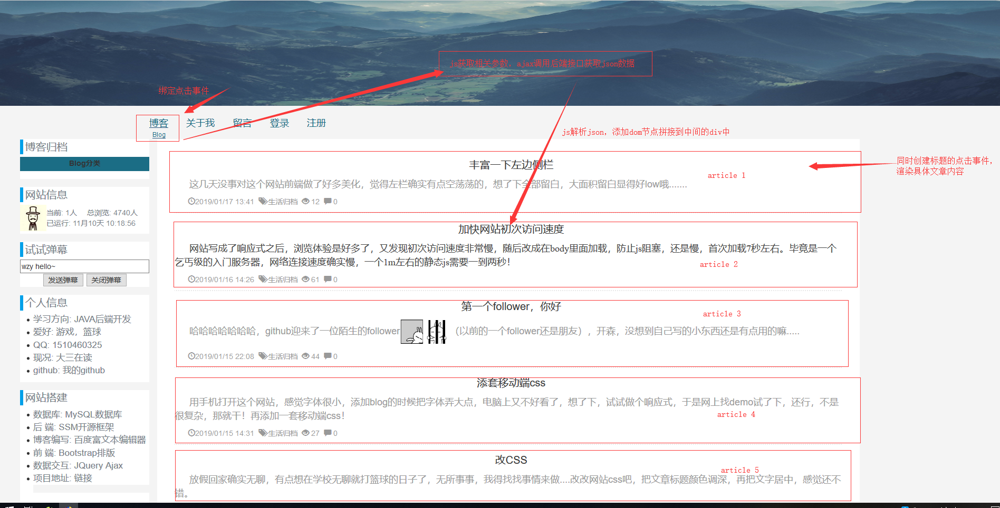

# blog2
个人博客2.0源码
### 关于网站
此项目为个人学习SSM的java后台开发过程中的练手项目，由个人全栈式开发完成。后端采用SSM框架搭建，为前端提供接口，采用json数据格式传输，
前端则采用jQuery库请求接口并渲染数据。此网站用于记录学习过程的知识点，用自己的语言描述出来可以深入理解！
### 前端设计  
  
前端为单页面开发，由js动态增删dom节点，大体设计：  
* 绑定点击事件
* 响应点击并请求后台接口
* 回调函数中js动态增删dom节点来改变页面
### 后端设计
六个表的insert和select操作，(由于修改和删除操作直接navicat操作更加方便，所以没写)  
1.文章分类表：所有的文章标签  
2.文章表：保存文章  
3.用户表：保存用户信息  
4.评论表：保存用户对文章的评论  
5.留言表：保存陌生人留言  
6.网站信息表：相当于参数表，用来展示网站信息（关于网站、浏览量、管理员密码之类的）  
### 细节处理
#### 添加文章处理
* 前端：采用富文本编辑器，将内容以html字符串的形式提交到后台
* 后台：将字符串转成字节数组，数据库存为blob类型
#### 文章代码块处理
文章中的代码块如果长度超过外层div的宽度就会伸出去，这就需要在添加文章的时候在\<pre>\</pre>外加一个div，
样式overflow:auto,为代码块下方自动设置滚动条
#### 用户评论和留言过滤脚本
data.replace(/&/g, "&amp").replace(/</g, "&lt").replace(/>/g, "&gt")